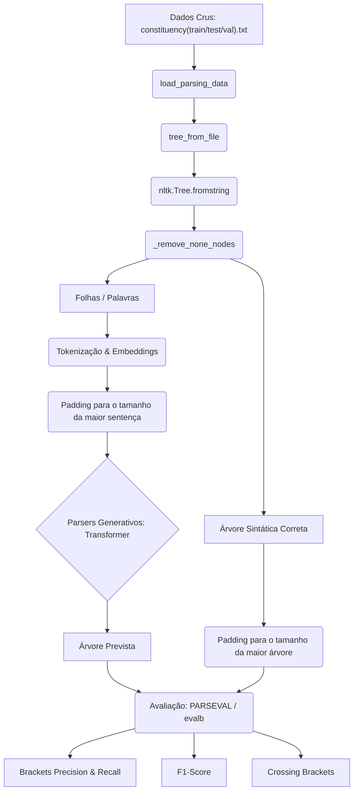
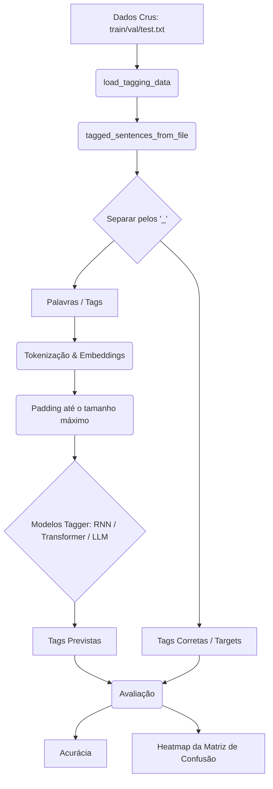

# Uso de Redes Neurais para Part of Speech Tagging e Parsing de Gramática de Constituintes

- **Jeremias Pinheiro de Araujo Andrade [@Jeremiasp7](https://github.com/Jeremiasp7)**
- **Lucas Apolonio de Amorim [(@lucasaamorim)](https://github.com/lucasaamorim)**
- **Moisés Ferreira de Lima [(@moisesferreira123)](https://github.com/moisesferreira123)**

Este repositório contém implementações de modelos para POS Tagging e Parsing de Gramática de Constituintes de sentenças. As tags e o dataset são provenientes do Penn [Treebank](https://en.wikipedia.org/wiki/Treebank).

## Desenvolvimento Local
Para desenvolvimento fora do google collab, também é possível sincronizar as dependências via uv:
```bash
uv sync
```

Ou com pip:
```bash
# Crie um venv para esse projeto
python3 -m venv caminho/para/o/ambiente
# Ative o ambiente
source caminho/para/o/ambiente/bin/activate
# Instale as dependências
pip install requirements.txt
```

## Execução
Para treinar um modelo:
```bash
...
```

Para usar um modelo:
```bash
...
```

## Detalhes de Implementação

### Fluxo geral

**Parsers**


**Taggers:**


### Pré-processamento de Dados
As sentenças e outputs são normalizados para o mesmo comprimento através da concatenação de padding. No caso dos taggers, todos os inputs e outputs tem o mesmo comprimento da sentença mais longa (medido em número de palavras), já no Parser, os inputs tem esse mesmo comprimento mas o output tem o comprimento da maior Árvore Gramatical.

A normalização utilizada foi somente de tornar todos os caracteres minúsculos de maneira indiscriminada (ou seja, até mesmo acrônimos como USA, BoFA, WSJ, etc.).

### Tokenização dos Dados de Entrada e Embeddings
Em geral, os embeddings continuam sendo treinados pelos modelos, mas são inicializados utilizando outros embeddings pré-treinados e, portanto, utilizam a tokenização proveniente dessas embeddings (com modificações eventuais para acomodar tags e possíveis palavras ausentes).

Para os taggers, foi utilizado somente Embeddings de Palavras inteiras, sendo usado o GloVe6B de referência para a camada de embedding dos modelos.

**TODO:** Especificar se foi testados embeddings de diferentes dimensionalidades, como 50d, 100d, 200d e 300d.

### Stack (Tecnologias)
Todos os modelos serão desenvolvidos utilizando TensorFlow/Keras em Python.

### Hiperparâmetros e Otimizadores
**TODO:** Decidir Otimizador utilizado, learning rate, loss function, batch size e critério de parada.

### Ambiente Computacional
O treinamento dos modelos foi realizado em uma máquina com as seguintes especificações:
...

## Modelos Implementados

### RNN (Moisés)
- **Tagger Baseado em RNN convencional:**
- **Tagger Baseado em LSTM:**

### Transformer (Lucas)
- **Tagger usando Encoder-Only:**
- **Tagger usando Decoder-Only:**
- **Tagger usando Encoder-Decoder:**

### Pré-Treinado (Jeremias)
- **Parsing Generativo usando uma LLM pré treinada (0-shot):**
- **Parsing Generativo usando uma LLM pré treinada + exemplos estáticos (few-shot):**
- **Parsing Generativo usando uma LLM pré treinada + exemplos dinâmicamente selecionados (RAG):**

## Avaliação
### POS Tagging
Para o modelos de tagging, foi utilizada a Acurácia. Também foi gerada uma Matriz de Confusão para cada modelo para permitir uma visualização geral do desempenho na forma de um mapa de calor (heatmap).

### Parsing da Gramática de Constituites
Para avaliar o desempenho do analisador sintático, são utilizadas as métricas do padrão **PARSEVAL** (através da biblioteca `evalb` ou similar em Python):
* **Brackets Precision:** Proporção de constituintes preditos pelo modelo que estão corretos de acordo com a árvore real.
* **Brackets Recall:** Proporção de constituintes da árvore real que foram identificados corretamente pelo modelo.
* **F1-Score de Constituintes:** A média harmônica entre a precisão e o recall dos constituintes.
* **Crossing Brackets:** O número médio de constituintes preditos que se cruzam/sobrepõem incorretamente com os constituintes reais.
