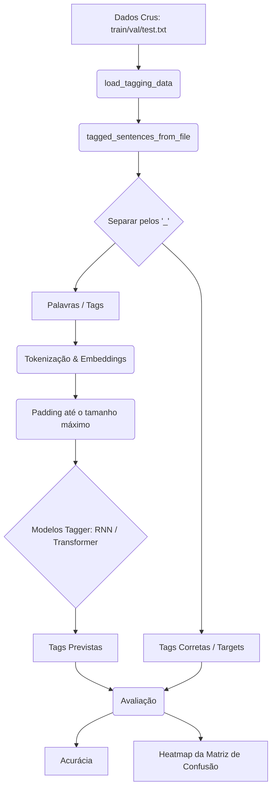

# Uso de Redes Neurais para Part of Speech Tagging

- **Jeremias Pinheiro de Araujo Andrade [@Jeremiasp7](https://github.com/Jeremiasp7)**
- **Lucas Apolonio de Amorim [(@lucasaamorim)](https://github.com/lucasaamorim)**
- **Moisés Ferreira de Lima [(@moisesferreira123)](https://github.com/moisesferreira123)**

Este repositório contém implementações de modelos para POS Tagging no tagset do Penn [Treebank](https://en.wikipedia.org/wiki/Treebank) (45 tags).

## Como Executar

### Pré-requisitos

- **Python 3.12+**
- **~5 GB de espaço** para os embeddings GloVe 6B (pode usar dimensão menor para reduzir)
- **GPU recomendada** (os modelos também rodam em CPU, mas o treinamento será lento)
- Os dados do Penn Treebank (já incluídos em `data/`) e os embeddings GloVe 6B (precisa baixar)

### Baixar os embeddings GloVe

```bash
mkdir -p data/glove.6B
wget -P data/glove.6B https://nlp.stanford.edu/data/glove.6B.zip
unzip data/glove.6B/glove.6B.zip -d data/glove.6B
rm data/glove.6B/glove.6B.zip   # opcional: libera ~800 MB
```

### Treinar um modelo

```bash
python -m src.models.encoder          # Transformer Encoder-Only
python -m src.models.decoder          # Transformer Decoder-Only
python -m src.models.encoder_decoder  # Transformer Encoder-Decoder
```

### Treinar todos os modelos sequencialmente

```bash
python -m src.models.train_all
```

### LLMs (zero-shot / few-shot / RAG)

```bash
export MISTRAL_API_KEY="sua-chave"

# Preparar os splits a partir do corpus do NLTK
python -m src.models.llm_with_rag.data_prep

# Executar tagging
python -m src.models.llm_with_rag.run_tagging --mode zero-shot
python -m src.models.llm_with_rag.run_tagging --mode few-shot --n-examples 5
python -m src.models.llm_with_rag.run_tagging --mode rag --n-examples 5

# Avaliar resultados
python -m src.utils.evaluation --compare zero-shot few-shot rag
```

---

## Desenvolvimento Local

### 1. Clonar e instalar dependências

Com **uv** (recomendado):
```bash
git clone <repo-url> && cd NLP
uv sync
```

Com **pip**:
```bash
git clone <repo-url> && cd NLP
python3 -m venv .venv
source .venv/bin/activate
pip install -r requirements.txt
```

### 2. Baixar os embeddings GloVe

Os scripts esperam encontrar os embeddings em `data/glove.6B/`. O diretório `data/` está no `.gitignore`, então é necessário baixá-los manualmente:

```bash
mkdir -p data/glove.6B
wget -P data/glove.6B https://nlp.stanford.edu/data/glove.6B.zip
unzip data/glove.6B/glove.6B.zip -d data/glove.6B
```

Arquivos esperados dentro de `data/glove.6B/`:
- `glove.6B.50d.txt`
- `glove.6B.100d.txt`
- `glove.6B.200d.txt`
- `glove.6B.300d.txt`

Os scripts usam por padrão a dimensão 300d. Para usar uma dimensão diferente, altere `embedding_dim` nos scripts.

### 3. Executar os modelos

Os scripts `__main__` de cada modelo executam o pipeline completo: carregamento de dados, tokenização, construção da arquitetura, treinamento e avaliação (incluindo matriz de confusão).

```bash
python -m src.models.encoder          # 2 blocos TransformerEncoder
python -m src.models.decoder          # 1 bloco TransformerDecoder (causal)
python -m src.models.encoder_decoder  # Encoder + Decoder com teacher forcing
python -m src.models.train_all        # Treina os três sequencialmente
```

**Atenção:** os scripts apontam o `glove_path` para `/content/drive/MyDrive/NLP/data/glove.6B/` (Google Colab). Se estiver rodando localmente, edite o `glove_path` em cada script para `data/glove.6B/glove.6B.300d.txt`, ou rode a partir da raiz do projeto com o caminho relativo correto. Em caso de `FileNotFoundError`, o treinamento prossegue sem os embeddings GloVe (inicialização aleatória), mas a acurácia será inferior.

---

## Treinamento no Google Colab

### 1. Configurar o ambiente

Abra um notebook no Google Colab com **runtime GPU** (T4 é suficiente). Monte o Google Drive para persistir os dados:

```python
from google.colab import drive
drive.mount("/content/drive")
```

### 2. Instalar dependências

```python
!pip install tensorflow keras keras-nlp keras-hub scikit-learn matplotlib seaborn nltk
```

### 3. Baixar os embeddings GloVe (se ainda não tiver)

```python
import os
glove_dir = "/content/drive/MyDrive/NLP/data/glove.6B"
os.makedirs(glove_dir, exist_ok=True)

!wget -P {glove_dir} https://nlp.stanford.edu/data/glove.6B.zip
!unzip {glove_dir}/glove.6B.zip -d {glove_dir}
!rm {glove_dir}/glove.6B.zip  # opcional
```

### 4. Clonar o repositório

```python
!git clone https://github.com/<seu-usuario>/NLP.git /content/drive/MyDrive/NLP/repo
%cd /content/drive/MyDrive/NLP/repo
```

> Os scripts já apontam `glove_path` para `/content/drive/MyDrive/NLP/data/glove.6B/`, compatível com a estrutura acima.

### 5. Treinar os modelos

```python
!python -m src.models.encoder
!python -m src.models.decoder
!python -m src.models.encoder_decoder

# Ou todos de uma vez:
!python -m src.models.train_all
```

### Estrutura esperada no Google Drive

```
/content/drive/MyDrive/NLP/
├── data/
│   └── glove.6B/
│       ├── glove.6B.50d.txt
│       ├── glove.6B.100d.txt
│       ├── glove.6B.200d.txt
│       └── glove.6B.300d.txt
└── repo/          # clone do repositório
    └── data/      # dados do Penn Treebank (já no repositório, mas estão no .gitignore)
```

> **Nota:** como `data/` está no `.gitignore`, os arquivos `.txt` do Penn Treebank precisam ser enviados separadamente ou copiados manualmente para o Colab. Faça upload dos arquivos `data/*.txt` para `/content/drive/MyDrive/NLP/repo/data/`.

---

## Detalhes de Implementação

### Fluxo geral

**Taggers:**


### Pré-processamento de Dados

As sentenças e outputs são normalizados para o mesmo comprimento através de padding. Nos taggers, inputs e outputs têm o comprimento da sentença mais longa (em número de palavras).

O módulo `src/utils/data_loader.py` fornece:
- `load_tagging_data()`: carrega os arquivos `train0-18.txt`, `val19-21.txt` e `test22-24.txt` do Penn Treebank, extraindo pares `(palavra, tag)` separados por `_`.
- `load_pretrained_embeddings()`: carrega embeddings GloVe para um dicionário `{palavra: vetor}`.

O módulo `src/utils/preprocessing.py` fornece:
- `tokenize_sentences()`: tokenização com `TextVectorization` do Keras (lowercase + whitespace split).
- `vectorize_tags()`: vetorização das tags com `StringLookup`, gerando a versão normal e a deslocada (`[START] + tags[:max_len-1]`) para o Encoder-Decoder com teacher forcing.
- `tokenize_sentences_subwords()`: tokenização por subpalavras para modelos Transformer, alinhando tags corretamente (primeira subword recebe a tag, demais recebem `-100` para serem ignoradas na loss).
- `build_embedding_matrix()`: constrói a matriz de pesos da camada de embedding cruzando o vocabulário do Keras com o dicionário GloVe. Palavras ausentes recebem inicialização aleatória `N(media, std)` dos vetores GloVe.

### Tokenização e Embeddings

As embeddings são inicializadas com **GloVe 6B (300d)** e **continuam sendo treinadas** pelos modelos (não são congeladas). Palavras ausentes no vocabulário GloVe são inicializadas com distribuição normal baseada na média e desvio padrão dos vetores GloVe. O token de padding (`[PAD]`, índice 0) recebe vetor nulo.

### Stack (Tecnologias)

TensorFlow / Keras (com `keras-nlp` para camadas `TokenAndPositionEmbedding`, `TransformerEncoder`, `TransformerDecoder`), scikit-learn, seaborn, matplotlib e NLTK.

### Hiperparâmetros

**Para os Transformers:**
- **Otimizador:** AdamW (`learning_rate=0.001`)
- **Loss:** `SparseCategoricalCrossentropy`
- **Batch size:** 32
- **Critério de parada:** EarlyStopping no `val_masked_acc`, patience=3, restore_best_weights
- **Dimensão de embedding:** 300 (GloVe 6B)
- **Específicos do Transformer:** `intermediate_dim=256, num_heads=4, dropout=0.2–0.3`

### Ambiente Computacional

Os modelos foram treinados usando uma GPU Nvidia Tesla T4 via Google Colab.

---

## Modelos Implementados

### Transformer (Lucas)

Arquiteturas de Transformer para POS Tagging, utilizando embeddings GloVe 6B 300d e métrica customizada `MaskedAccuracy` (ignora padding, subwords excedentes e pontuações):

- **Encoder-Only** (`src/models/encoder.py`): 2 blocos `TransformerEncoder` empilhados (dropout 0.3 no primeiro, 0.2 no segundo). Entrada: tokens da sentença com positional encoding. Classificação softmax por posição. Aproximadamente análogo a um BERT para tagging.

- **Decoder-Only** (`src/models/decoder.py`): 1 bloco `TransformerDecoder` com máscara causal. Entrada: tokens da sentença (sem deslocamento, ao contrário do Encoder-Decoder). Auto-atenção com causal masking + classificação softmax por token.

- **Encoder-Decoder** (`src/models/encoder_decoder.py`): Encoder processa a sentença de entrada; Decoder gera as tags usando **teacher forcing**: recebe como entrada as tags deslocadas (`[START], tag_0, tag_1, ...`). Embeddings separadas: palavras (300d, inicializadas com GloVe) e tags (64d, aprendidas do zero). Um bloco `TransformerEncoder` + um bloco `TransformerDecoder` com cross-attention sobre a saída do encoder.

### LLMs (Jeremias)

Pipeline de POS Tagging usando modelos de linguagem via API (Mistral), em três modos:

- **Zero-shot** (`src/models/llm_with_rag/run_tagging.py --mode zero-shot`): o modelo recebe apenas a lista de tokens e o tagset do Penn Treebank nas instruções de sistema, sem exemplos.

- **Few-shot** (`--mode few-shot`): inclui no prompt 5 exemplos fixos (sentenças com tags corretas) extraídos do conjunto de treino.

- **RAG** (`--mode rag`): em vez de exemplos fixos, recupera dinamicamente as `k` sentenças mais similares do conjunto de treino usando **TF-IDF + similaridade de cosseno** (`KNNRetriever` em `src/models/llm_with_rag/retrieval.py`).

Os prompts estão em `src/models/llm_with_rag/prompts.py`, o cliente da API do Mistral em `src/models/llm_with_rag/gemini_client.py` (usa `urllib`, sem `requests`). Requer `MISTRAL_API_KEY` no ambiente.

### RNN (Moisés)

- **Tagger Baseado em RNN/LSTM:** notebook standalone com implementações de RNN e LSTM para POS Tagging.

Para executar, abra o notebook no Jupyter, VS Code ou Google Colab e execute todas as células sequencialmente. O notebook carrega os dados, constrói o modelo e treina de forma independente (não depende dos módulos `src/`).

---

## Avaliação

### POS Tagging (Transformers)

- **MaskedAccuracy:** métrica customizada que ignora tokens de padding, subwords marcadas com `-100`, pontuações (`.`, `,`, `:`, `''`, `` ` ``, `-LRB-`, `-RRB-`, `#`, `$`) e tokens especiais (`[START]`, `[UNK]`).
- **Matriz de Confusão:** heatmap salvo como PNG mostrando a distribuição de erros entre tags.

### POS Tagging (LLMs)

- **Acurácia token-level:** proporção de tokens com tag correta. Sentenças com erro de parsing (número de tags diferente do esperado) são contadas separadamente como "falha de geração".
- **Classification report:** precision, recall e f1-score por tag (via `sklearn`).
- **Matriz de confusão normalizada:** comparando tags reais vs preditas.

Script de avaliação:
```bash
python -m src.utils.evaluation --mode zero-shot          # avalia um modo
python -m src.utils.evaluation --compare zero-shot few-shot rag  # tabela comparativa
```
Os resultados são salvos em `src/models/results/*.json` e as matrizes em `src/models/results/confusion_matrix_*.png`. Um resumo comparativo é gerado em `src/models/results/comparison_summary.json`.


