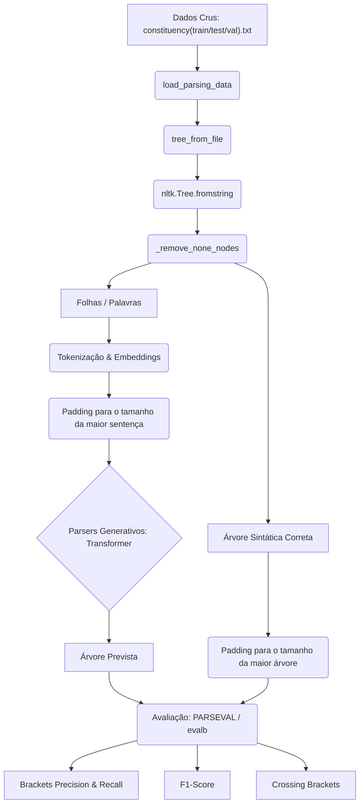
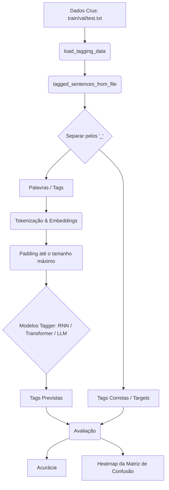

# Uso de Redes Neurais para Part of Speech Tagging e Parsing de Gramática de Constituintes

- **Jeremias Pinheiro de Araujo Andrade [@Jeremiasp7](https://github.com/Jeremiasp7)**
- **Lucas Apolonio de Amorim [(@lucasaamorim)](https://github.com/lucasaamorim)**
- **Moisés Ferreira de Lima [(@moisesferreira123)](https://github.com/moisesferreira123)**

Este repositório contém implementações de modelos para POS Tagging e Parsing de Gramática de Constituintes de sentenças. As tags e o dataset são provenientes do Penn [Treebank](https://en.wikipedia.org/wiki/Treebank).

## Desenvolvimento Local
Para desenvolvimento fora do Google Colab, sincronize as dependências via uv:
```bash
uv sync
```

Ou com pip:
```bash
python3 -m venv .venv
source .venv/bin/activate
pip install -r requirements.txt
```

## Execução

Treinar um modelo individual (Transformers):
```bash
python src/models/encoder.py          # Transformer Encoder-Only
python src/models/decoder.py          # Transformer Decoder-Only
python src/models/encoder_decoder.py  # Transformer Encoder-Decoder
```

Treinar todos os modelos sequencialmente (Transformers):
```bash
python src/models/train_all.py
```

> Os caminhos para embeddings GloVe nos scripts apontam para `/content/drive/MyDrive/NLP/` (Google Colab). Para execução local, ajuste o `glove_path` para `data/glove.6B/glove.6B.{dim}d.txt`.

## Detalhes de Implementação

### Fluxo geral

**Parsers:**


**Taggers:**


### Pré-processamento de Dados
As sentenças e outputs são normalizados para o mesmo comprimento através de padding. Nos taggers, inputs e outputs têm o comprimento da sentença mais longa (em número de palavras). No parser, o output tem o comprimento da maior árvore gramatical. A normalização consiste em tornar todos os caracteres minúsculos.

### Tokenização e Embeddings
As embeddings são inicializadas com GloVe 6B (300d) e continuam sendo treinadas pelos modelos. Palavras ausentes no vocabulário GloVe são inicializadas com distribuição normal baseada na média e desvio padrão dos vetores GloVe.

### Stack (Tecnologias)
TensorFlow / Keras (com keras-nlp e keras-hub).

### Hiperparâmetros
**Para os Transformers:**
- **Otimizador:** AdamW (`learning_rate=0.001`)
- **Loss:** `SparseCategoricalCrossentropy`
- **Batch size:** 32
- **Critério de parada:** EarlyStopping no `val_masked_acc`, patience=3, restore_best_weights
- **Dimensão de embedding:** 300 (GloVe 6B)
- **Específicos do Transformer** `intermediate_dim=256, num_heads=4, dropout=0.2–0.3`

### Ambiente Computacional
Os modelos foram treinados usando uma GPU Nvidia Tesla T4 via Google Colab.

## Modelos Implementados

### Transformer (Lucas)
Arquiteturas de Transformer para POS Tagging, utilizando embeddings GloVe 6B 300d e métrica customizada `MaskedAccuracy` (ignora padding, subwords excedentes e pontuações):

- **Encoder-Only:** 2 blocos `TransformerEncoder` + classificação softmax por token. (~`src/models/encoder.py`)
- **Decoder-Only:** 1 bloco `TransformerDecoder` causal + classificação softmax por token. (~`src/models/decoder.py`)
- **Encoder-Decoder:** Encoder processa a sentença, Decoder gera as tags usando teacher forcing (`[START]` como primeiro token). Embedding de palavras (300d) e de tags (64d) separadas. (~`src/models/encoder_decoder.py`)

### RNN (Moisés) — pendente
- **Tagger Baseado em RNN convencional:** notebooks `rnn.ipynb` e `lstm.ipynb` (stubs)

### Pré-Treinado (Jeremias) — planejado
- **Parsing Generativo usando uma LLM pré-treinada (0-shot):**
- **Parsing Generativo usando uma LLM pré-treinada + exemplos estáticos (few-shot):**
- **Parsing Generativo usando uma LLM pré-treinada + exemplos dinamicamente selecionados (RAG):**

## Avaliação

### POS Tagging
Acurácia mascarada (`MaskedAccuracy`) que ignora padding e pontuações. Matriz de Confusão (heatmap) para visualização geral do desempenho.

### Parsing da Gramática de Constituintes
Métricas do padrão **PARSEVAL** (via `evalb` ou similar):
* **Brackets Precision:** Proporção de constituintes preditos corretos.
* **Brackets Recall:** Proporção de constituintes reais identificados.
* **F1-Score de Constituintes:** Média harmônica de precisão e recall.
* **Crossing Brackets:** Constituintes preditos que se cruzam incorretamente com os reais.
